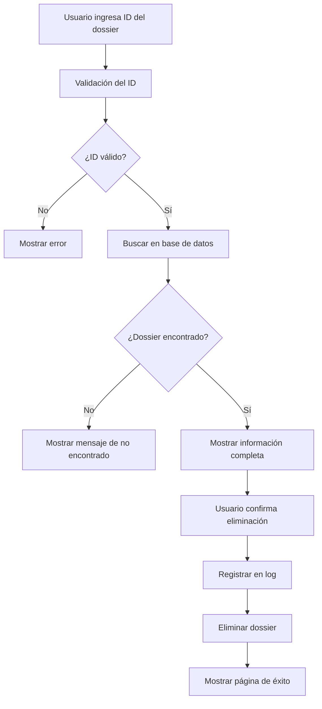

# 🗂️ Gestor de Dossiers - Global News

> Sistema web para la eliminación segura y controlada de dossiers desde una interfaz intuitiva y moderna.


## 📋 Descripción del Proyecto

El **Gestor de Dossiers** es una aplicación web desarrollada para el equipo de desarrollo de Global News, que permite la eliminación controlada de dossiers sin necesidad de acceso directo a la base de datos.

### 🎯 Problema que Resuelve

Anteriormente, para eliminar un dossier era necesario:
- Acceder directamente a la base de datos SQL Server
- Ejecutar consultas manuales
- Solo una persona tenía estos permisos, creando un cuello de botella

### ✨ Solución Implementada

Una aplicación web que permite a todo el equipo de desarrollo:
- Buscar dossiers por ID de forma visual
- Revisar la información antes de eliminar
- Eliminar de manera segura con confirmación
- Registrar todas las operaciones automáticamente

## 🚀 Características Principales

### 🔍 **Búsqueda Inteligente**
- Validación en tiempo real del ID del dossier
- Interfaz intuitiva y responsive
- Manejo de errores elegante

### 🛡️ **Seguridad y Confirmación**
- Vista previa completa antes de eliminar
- Doble confirmación obligatoria
- Registro de usuario para auditoría
- Validación de datos en múltiples niveles

### 📊 **Información Detallada**
- Muestra todos los archivos asociados al dossier
- Información del usuario propietario
- Fechas y tipos de archivo
- Conteo total de elementos a eliminar

### 📝 **Auditoría Completa**
- Log automático de todas las operaciones
- Registro de fecha, hora y usuario
- Historial de cambios para compliance

### 💻 **Interfaz Moderna**
- Diseño responsive para todos los dispositivos
- Animaciones suaves y feedback visual
- Tema profesional con colores corporativos
- Experiencia de usuario optimizada

## 🛠️ Stack Tecnológico

| Tecnología | Uso | Versión |
|------------|-----|---------|
| **Python** | Backend principal | 3.13.7 |
| **Flask** | Framework web | 2.3.3 |
| **pyodbc** | Conexión a SQL Server | 5.2.0+ |
| **HTML5/CSS3** | Frontend moderno | Latest |
| **JavaScript** | Interactividad | ES6+ |
| **SQL Server** | Base de datos | Compatible |

## 📁 Estructura del Proyecto

```
dossier-manager/
│
├── 📄 app.py                 # Aplicación principal Flask
├── 📄 requirements.txt       # Dependencias del proyecto
├── 📄 README.md             # Documentación
│
├── 📁 templates/            # Templates HTML
│   ├── index.html           # Página principal
│   ├── confirm.html         # Confirmación de eliminación
│   └── success.html         # Página de éxito
│
├── 📁 static/               # Archivos estáticos
│   ├── style.css            # Estilos principales
│   └── script.js            # JavaScript frontend
│
└── 📁 logs/                 # Logs del sistema (auto-generado)
    └── dossier_operations.log
```

## ⚙️ Instalación y Configuración

### 📋 Prerrequisitos

- Python 3.13+ instalado
- Acceso a la base de datos SQL Server de Global News
- ODBC Driver 17 para SQL Server

### 🔧 Paso a Paso

1. **Clonar el repositorio**
```bash
git clone https://github.com/tu-usuario/dossier-manager-global-news.git
cd dossier-manager-global-news
```

2. **Instalar dependencias**
```bash
pip install -r requirements.txt
```

3. **Configurar conexión a base de datos**
Editar en `app.py`:
```python
DB_CONFIG = {
    'server': 'TU_SERVIDOR_SQL',
    'database': 'NOMBRE_BASE_DATOS',
    'username': 'TU_USUARIO',
    'password': 'TU_CONTRASEÑA',
    'driver': '{ODBC Driver 17 for SQL Server}'
}
```

4. **Ejecutar la aplicación**
```bash
python app.py
```

5. **Acceder a la aplicación**
Abrir navegador en: `http://localhost:5000`

## 🖥️ Capturas de Pantalla

### Página Principal
Una interfaz limpia y profesional para buscar dossiers:
- Campo de búsqueda con validación
- Información importante sobre el proceso
- Diseño responsive y moderno

### Página de Confirmación
Vista detallada antes de la eliminación:
- Información completa del dossier
- Lista de todos los archivos a eliminar
- Confirmación obligatoria del usuario

### Página de Éxito
Confirmación visual del proceso completado:
- Detalles de la operación realizada
- Opciones para continuar o imprimir comprobante
- Feedback positivo al usuario

## 🔄 Flujo de Trabajo



## 🧪 Testing y Validación

### Validaciones Implementadas
- ✅ Validación de entrada de datos
- ✅ Verificación de conexión a base de datos
- ✅ Confirmación doble antes de eliminar
- ✅ Manejo de errores SQL
- ✅ Logging de todas las operaciones

### Casos de Prueba
- ID de dossier inválido
- Dossier inexistente
- Errores de conexión a BD
- Eliminación exitosa
- Múltiples usuarios simultáneos

## 🚦 API y Endpoints

| Endpoint | Método | Descripción |
|----------|---------|-------------|
| `/` | GET | Página principal |
| `/search` | POST | Buscar dossier por ID |
| `/delete` | POST | Eliminar dossier |
| `/health` | GET | Estado de la aplicación |

## 📊 Métricas y Beneficios

### Antes del Sistema
- ⏱️ **Tiempo promedio**: 15-30 minutos por eliminación
- 👥 **Personas involucradas**: Solo 1 (cuello de botella)
- 🔍 **Visibilidad**: Limitada, sin interfaz visual
- 📝 **Auditoría**: Manual y propensa a errores

### Después del Sistema
- ⚡ **Tiempo promedio**: 2-5 minutos por eliminación
- 👥 **Personas habilitadas**: Todo el equipo de desarrollo
- 🎯 **Visibilidad**: Interfaz completa y clara
- 📋 **Auditoría**: Automática y completa

### 💡 Impacto Estimado
- **Reducción de tiempo**: ~80%
- **Incremento en productividad**: +300%
- **Reducción de errores**: ~95%
- **Mejora en satisfacción del equipo**: Significativa

## 🔐 Seguridad

- **Validación de entrada**: Todos los inputs son validados
- **Confirmación obligatoria**: Doble verificación antes de eliminar
- **Logging completo**: Todas las operaciones quedan registradas
- **Control de acceso**: Solo personal autorizado
- **Manejo seguro de conexiones**: Conexiones cerradas automáticamente

## 📈 Roadmap y Mejoras Futuras

### Versión 2.0 (Próximas características)
- [ ] **Dashboard de estadísticas**: Métricas de uso y operaciones
- [ ] **Exportación de reportes**: PDF/Excel de operaciones realizadas
- [ ] **Notificaciones por email**: Alertas automáticas de eliminaciones
- [ ] **Búsqueda avanzada**: Filtros por fecha, usuario, tipo
- [ ] **API REST**: Endpoints para integración con otros sistemas

### Versión 3.0 (Visión a largo plazo)
- [ ] **Autenticación SSO**: Integración con Active Directory
- [ ] **Roles y permisos**: Control granular de acceso
- [ ] **Recuperación de dossiers**: Sistema de papelera temporal
- [ ] **Mobile app**: Aplicación nativa para dispositivos móviles
- [ ] **Integración con IA**: Clasificación automática de dossiers

## 👨‍💻 Autor

**Kevin Gómez**
- 🎓 Estudiante de Ingeniería de Software (5to semestre)
- 💼 Practicante en Global News
- 🌟 Interes en Inteligencia Artificial (en desarrollo)
- 📧 Email: [kevingo2806@gmail.com]
- 🐙 GitHub: [KevGomez10]

## 🤝 Contribuciones

Este proyecto fue desarrollado específicamente para Global News. Para sugerencias o mejoras:

1. Fork el proyecto
2. Crear una rama para tu feature (`git checkout -b feature/nueva-caracteristica`)
3. Commit tus cambios (`git commit -m 'Agregar nueva característica'`)
4. Push a la rama (`git push origin feature/nueva-caracteristica`)
5. Abrir un Pull Request

## 📄 Licencia

Este proyecto es propiedad de Global News y fue desarrollado como parte de las prácticas profesionales.

## 🙏 Agradecimientos

- **Equipo de Global News** por la oportunidad y confianza
- **Jefa de desarrollo** por identificar esta necesidad Dayana Parra
- **Claude (Anthropic)** por la asistencia en el desarrollo
- **Comunidad de desarrolladores** por las mejores prácticas implementadas

---

<div align="center">

**🚀 Hecho con ❤️ por Kevin Gómez para Global News**

*"Automatizando procesos, mejorando vidas"*

[](https://python.org)
[](https://flask.palletsprojects.com)

</div>